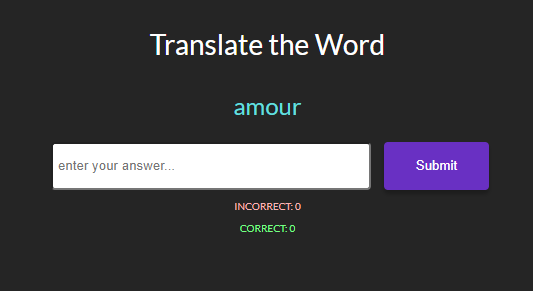

# Ok Language Client

- [Live_App](https://ok-la-client.vercel.app/)
- [Server_Side_Repo](https://github.com/RShuken/ok-la-server)
- [Client_Side_Repo](https://github.com/RShuken/ok-la-client)

## Description

This is a full stack project that showcases my ability to create custom data structures using linked list, React, Express and Node to create a language learning community platform.

Users can add community language flashcard decks, create their own and share.

# Demo Account

Login with this user and password to test the app.

`Username: demo`
`Password: 1234Qwer!`

Create your own account and a default deck of `french` will be created for you. Add more decks in the community hub. On your dashboard page, create a new deck. You must add a `minimum of 3` cards to start learning with a deck. Make the deck public by clicking the checkbox to share it to the community.

## Screenshots

### Front-end technologies

Reactjs, HTML, CSS, JavaScript, HTML

### Back-end technologies

Node.js, Express

### Database

PostgreSQL

### Testing and Scripts

to install all scripts run:

`npm install`

test are done in enzyme and jest

all test files are located inside each component that is tested

to test run:

`npm test`

### Hosted on

Heroku and Vercel
